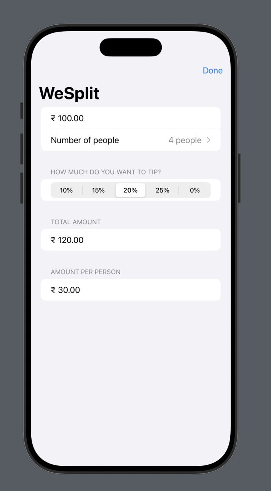

# WeSplit 🧾

WeSplit is a simple SwiftUI app that helps users split a bill among friends and calculate tips. It was created as part of my learning journey during the **30 Days of SwiftUI** challenge.

---

## 🚀 Features

- Enter bill amount
- Select number of people to split the bill
- Choose tip percentage
- Instantly calculates:
  - Total amount including tip
  - Amount each person needs to pay

---

## 🛠 Built With

- **SwiftUI** – Declarative UI framework by Apple
- **Xcode** – Developed and tested in Xcode
- **Swift** – Language used for building the app

---

## 📸 Screenshot

Here’s how the app looks:

---

## 📚 Learning Purpose

This app was created to practice:
- Form-based layout in SwiftUI
- Working with `@State` properties
- Handling text input and number formatting
- Basic arithmetic logic in UI apps

> Although I’m no longer actively pursuing SwiftUI, I’m proud of this project as part of my learning archive.

---

## 📁 Project Status

✅ Completed  
📦 Archived (not under active development)

---

## 📜 License

This project is open source and available under the [MIT License](LICENSE).

